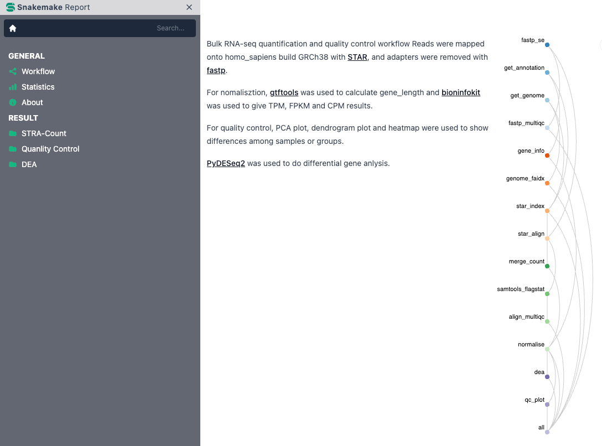
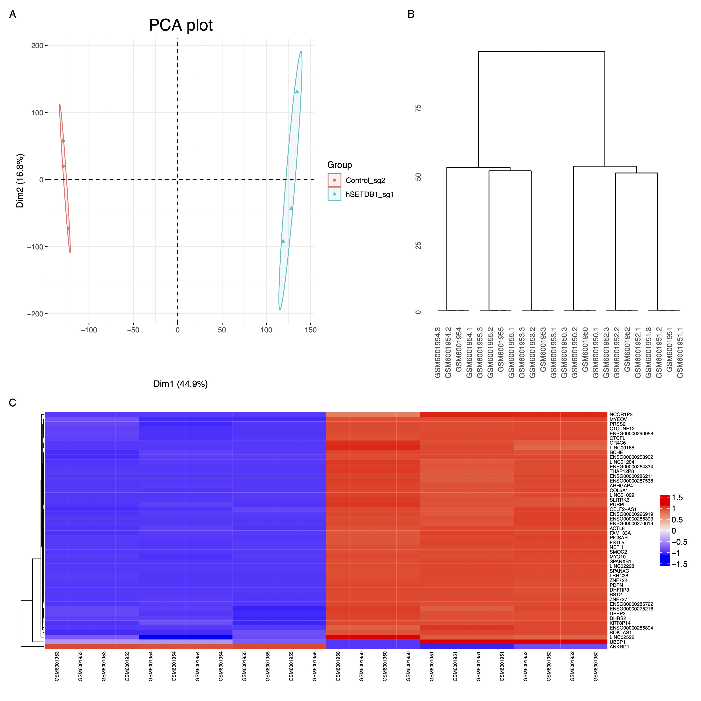
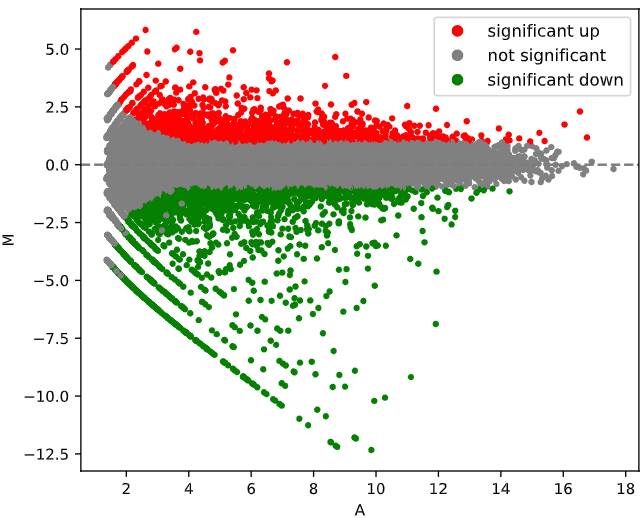
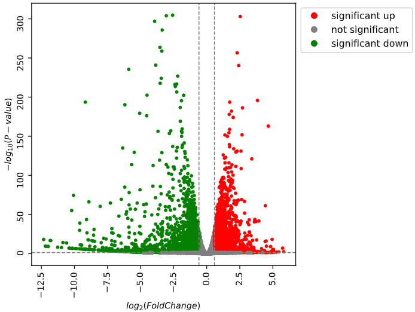

# A SnakeMake workflow for Bulk RNA-seq

Reads were mapped onto genome with **STAR**, and adapters were removed with fastp.

For nomalisztion, **gtftools** was used to calculate gene_length and **bioninfokit** was used to give TPM, FPKM and CPM results.

For quality control, PCA plot, dendrogram plot and heatmap were used to show differences among samples or groups.

**PyDESeq2** was used to perform differential expression anlysis.

# General settings
To configure this workflow, modify ``config/config.yaml`` according to your needs, following the explanations provided in the file.

# Sample sheet
* Add samples to `config/samples.tsv`. Only the column `Sample` is mandatory, but any additional columns can be added.
* For each sample, add one or more sequencing units (runs, lanes or replicates) to the `Unit` column of `config/samples.tsv`. 
* For each sample, define `Group` column(experimental or clinical attribute).

# To use
```bash
python run_rna.py \
    --fastqs fastq \
    --species mtu \
    --is_pair_end True \
    --samples sample.tsv \
    --outdir ./ \
    --compare compare.tsv \
    --pvalue 0.05 \
    --use_adjust_p True \
    --lfc 0.585 \
    --n_jobs 8
```

# help
```text
run_rna.py -h
usage: run_rna.py [-h] -f FASTQS -s {hsa,mmu,mtu} -p {True,False} -m SAMPLES -o OUTDIR [-c COMPARE] [-v PVALUE] [-u USE_ADJUST_P] [-l LFC] [-n N_JOBS] [-r] [-d]

RNA-seq

options:
  -h, --help            show this help message and exit
  -f FASTQS, --fastqs FASTQS
                        dir of fastq files
  -s {hsa,mmu,mtu}, --species {hsa,mmu,mtu}
                        species ABBR. one of hsa, mmu, mtu
  -p {True,False}, --is_pair_end {True,False}
                        out dir path
  -m SAMPLES, --samples SAMPLES
                        sample.tsv file path
  -o OUTDIR, --outdir OUTDIR
                        out_dir
  -c COMPARE, --compare COMPARE
                        compare.tsv file path
  -v PVALUE, --pvalue PVALUE
                        pvalue cutoff
  -u USE_ADJUST_P, --use_adjust_p USE_ADJUST_P
                        use adjust pvalue or not
  -l LFC, --lfc LFC     log2FoldChange cutoff
  -n N_JOBS, --n_jobs N_JOBS
                        no. of cpu to use
  -r, --rerun_incomplete
                        rerun incomplete pipline
  -d, --dry_run         fake run
```

# Report


# QC plot


# Differential expression anlysis

## MA plot

## Volcano plot
